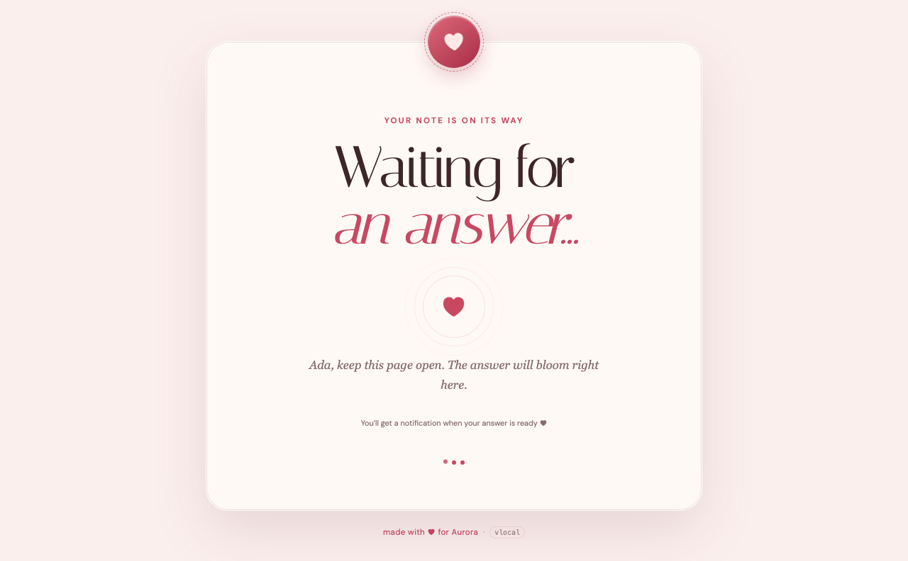

# Love Tracker

> [!IMPORTANT]
> **This entire repository, including the application, design, tests, documentation, and deployment setup was made with AI.**

A small romantic web app for asking someone how much they are loved. Love Tracker
sends a private Pushover link to the person answering; they can reply with a score
from 0–1000%, optionally share their approximate location, and attach a photo. The
requester's screen reveals the answer with an animated counter, a visual 0–100%
meter, and an optional map connecting both hearts.

## Screenshots

| Waiting with notifications enabled                                                | Answer reveal and love journey                                          |
| --------------------------------------------------------------------------------- | ----------------------------------------------------------------------- |
|  |  |

## Features

- Private, random response links delivered through Pushover
- Animated score reveal with many score-matched messages
- Optional approximate-location journey on a real-world map
- Optional camera/photo response
- Installable iOS home-screen experience
- Optional iOS Home Screen notification when an answer is ready
- One-time Pushover notification when the asker sees the answered love message
- Deployment version embedded in the HTML and asset URLs
- Persistent request and photo storage with automatic seven-day expiry

## Run locally

Requires Node.js 24.18.1 LTS or a newer Node.js 24 release.

```sh
cp .env.example .env
set -a
source .env
set +a
npm ci
npm run build
npm start
```

Without Pushover credentials, development mode prints the private response URL to
the terminal. Open <http://localhost:3000>.

## Environment variables

| Variable                        | Required   | Description                                                                                                |
| ------------------------------- | ---------- | ---------------------------------------------------------------------------------------------------------- |
| `LOVE_NAME`                     | No         | Name shown in the example input and “made with love” footer. Defaults to `Aurora`.                         |
| `IP_GEOLOCATION_ENABLED`        | No         | Set to `false` to disable automatic coarse IP geolocation. Enabled by default.                             |
| `IP_GEOLOCATION_URL`            | No         | IP lookup URL containing an `{ip}` placeholder. Defaults to `https://ipwho.is/{ip}`.                       |
| `PUBLIC_URL`                    | Production | Public base URL used in Pushover response links.                                                           |
| `PUSHOVER_APP_TOKEN`            | Production | Application token from Pushover.                                                                           |
| `PUSHOVER_USER_KEY`             | Production | Pushover user or group key receiving response links and seen receipts.                                     |
| `PUSHOVER_API_URL`              | No         | Pushover-compatible API endpoint. Defaults to the official Pushover messages API; override it for testing. |
| `VAPID_PUBLIC_KEY`              | Production | Public VAPID key used by browsers to create Web Push subscriptions.                                        |
| `VAPID_PRIVATE_KEY`             | Production | Secret VAPID key used by the server to sign Web Push delivery requests.                                    |
| `VAPID_SUBJECT`                 | Production | Contact URI for Web Push, such as `mailto:notifications@example.com` or the public app URL.                |
| `DATA_DIR`                      | No         | Persistent request/photo directory. Defaults to `./data` locally and `/data` in Docker.                    |
| `PORT`                          | No         | HTTP port. Defaults to `3000`.                                                                             |
| `APP_VERSION` / `SOURCE_COMMIT` | No         | Deployment identifier embedded in HTML and asset URLs. Coolify can provide the commit automatically.       |

Set `LOVE_NAME` to personalize the installation:

```env
LOVE_NAME=Aurora
```

The value is server-rendered and safely HTML-escaped; changing it requires a
restart or redeployment.

`npm run build` copies Leaflet JavaScript, CSS, images, and the required DM Sans
and Italiana font files from lockfile-pinned npm packages into `public/vendor`.
The deployed pages do not load executable code or fonts from a CDN. Map tiles
remain an external data service provided by OpenStreetMap.

## Docker Compose

Copy the included example and adjust `.env` before starting it:

```sh
cp compose.example.yml compose.yml
cp .env.example .env
docker compose up -d --build
```

The example publishes the app on `${PORT:-3000}`, builds the local Dockerfile,
and stores requests and photos in the persistent `love-tracker-data` volume.
The production process runs as the unprivileged `node` user (UID/GID 1000).
Existing bind mounts must be writable by that user before upgrading.

## Coolify deployment

1. Create an **Application** from this Git repository.
2. Choose **Dockerfile** as the build pack. The app listens on port `3000`.
3. Add a persistent storage mount with destination `/data`.
4. Configure `PUBLIC_URL`, `PUSHOVER_APP_TOKEN`, `PUSHOVER_USER_KEY`,
   `LOVE_NAME`, and a VAPID key pair. Generate the pair once with
   `npx web-push generate-vapid-keys`; keep the private key secret.
5. Set `APP_VERSION` to Coolify's source commit variable if it is not already
   supplied as `SOURCE_COMMIT`.
6. Add the domain and deploy.

The health check endpoint is `GET /health`.

## iOS answer notifications

On iOS 16.4 or newer, add Love Tracker to the Home Screen from Safari's Share
menu and open that installed app. After creating a request, tap **Notify me when
it is ready** and allow notifications. When the private response is submitted,
the installed app receives a notification that opens the matching request URL.
The permission prompt must follow this explicit tap; iOS does not permit sites to
request notification permission automatically.

## Testing

Run the unit tests with `npm run test:unit` and the Playwright browser journeys
with `npm run test:e2e`. Install Chromium once before the first local E2E run:

```bash
npx playwright install chromium
```

The unit suite exercises API validation, concurrent answer protection, expiry,
location shaping, photo privacy, cache headers, and notification failures through
ephemeral local servers. The E2E suite drives the request and private answer pages
with and without shared locations while using local mock Pushover and encrypted
Web Push endpoints. It also covers waiting-page recovery, a real photo
upload/reveal, fresh follow-up requests, and German and Brazilian Portuguese
selection. CI retains its JUnit output, HTML report, screenshots, and failure
traces/videos as workflow artifacts.

### Gitea Container Registry

The Gitea Actions workflow tests the app, builds its Docker image on pushes, and
publishes it to:

```text
<gitea-host>/<repository-owner>/love-tracker
```

Every branch receives one mutable tag derived from its name. Registry tags cannot
contain `/`, so unsupported characters are replaced with `-`; for example,
`codex/gitea-registry-coolify-staging` becomes
`codex-gitea-registry-coolify-staging`. The branch tag is removed when its branch
is deleted or its pull request is merged. After a `main` build, obsolete Love
Tracker package versions are removed, leaving only `main`. Add a repository
Actions secret named `REGISTRY_TOKEN` containing a Gitea personal access token
with package read/write permission. The workflow requests only `contents: read`
and `packages: write`. The registry host, repository owner, and package name are
derived from Gitea's workflow context, so no instance-specific values are stored
in the repository.

## Privacy and lifecycle

Browser geolocation remains opt-in and controls the animated journey map. Unless
disabled by the operator, the app also derives a coarse city/region estimate from
the requester's IP through the configured lookup provider. This is disclosed on
the request form; the raw IP is neither stored nor shown on the answer screen.
IP-based locations can be wrong, especially with VPNs, mobile networks, and shared
connections, and must not be treated as proof of identity.

Response links contain a random 192-bit token and act as private bearer links.
Requests, coarse location results, seen timestamps, and optional photos are stored under `DATA_DIR`
and automatically expire after seven days. An optional push subscription is kept
only while its request is waiting and is removed when answered. Keep a single application replica
unless the file store is replaced with shared storage or a database.

## License

[MIT](LICENSE)
